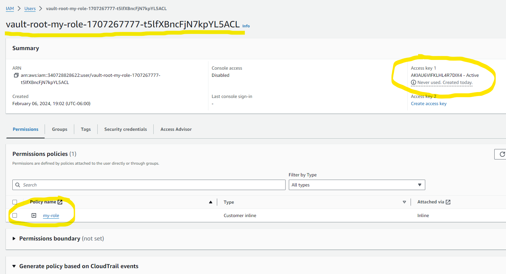

layout: true
class: img-right
background-image: url(./assets/images/backgrounds/HashiCorp-Content-bkg.png)
background-size: cover
name: s7-conclusion

## Wrapping Up: Why Use Dynamic Secrets with AWS?

- 
- 
- 

???
There are many other reasons that one could come up with to utilize Vault's dynamic secrets with AWS, this was just a showcase of how to deploy and implement dynamic secrets into AWS. The world is yours!

